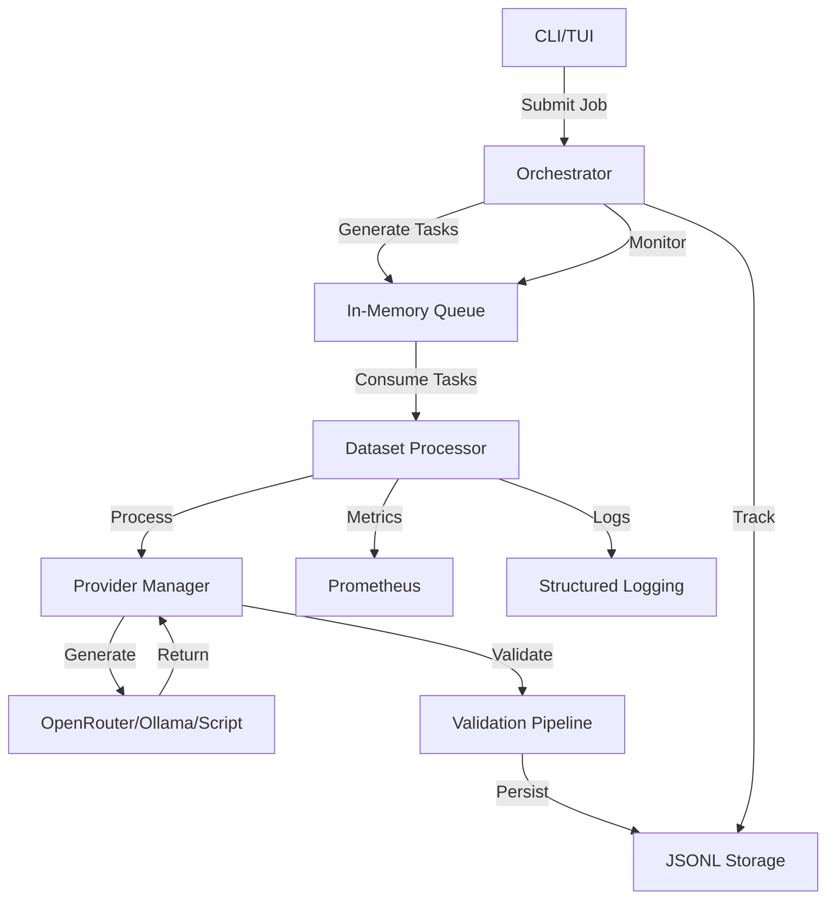

# Destilation Refactoring Plan

## Overview
This plan outlines the refactoring and improvement strategy for Destilation based on the project x-ray analysis. Key changes include:
- Implementing in-memory queue for task management (lightweight, no external dependencies)
- Creating centralized dataset processor with queue-based architecture
- Maintaining plain-text data storage (JSONL) for flexibility
- Keeping credentials in config files (as per requirements)
- Addressing performance, reliability, and maintainability issues

## Refactoring Phases

### Phase 1: Queue Architecture (High Priority)

#### 1.1 In-Memory Queue Implementation
- [ ] Create async in-memory task queue abstraction
- [ ] Implement `MemoryTaskQueue` with bounded capacity
- [ ] Add task enqueue/dequeue operations
- [ ] Implement task priority and batching support
- [ ] Add queue metrics (size, backpressure, latency)

#### 1.2 Centralized Dataset Processor
- [ ] Create standalone dataset processor service
- [ ] Implement queue consumer with backpressure
- [ ] Add task batching for efficient processing
- [ ] Implement failure handling and retry logic
- [ ] Add metrics for queue processing

#### 1.3 Orchestrator Simplification
- [ ] Extract task generation to separate component
- [ ] Simplify orchestrator to manage job lifecycle
- [ ] Implement task dispatch to in-memory queue
- [ ] Add queue monitoring to orchestrator
- [ ] Remove direct task processing from orchestrator

### Phase 2: Storage & Persistence Improvements

#### 2.1 Async File I/O
- [ ] Replace synchronous file operations with `tokio::fs`
- [ ] Implement async atomic writes
- [ ] Add write-ahead logging for consistency
- [ ] Implement sample batching for persistence
- [ ] Add compression support (gzip, zstd)

#### 2.2 Directory Storage Optimization
- [ ] Improve directory structure for large datasets
- [ ] Implement shard-based storage for parallel processing
- [ ] Add metadata caching for faster access
- [ ] Implement incremental dataset loading
- [ ] Add dataset versioning support

### Phase 3: Provider System Enhancements

#### 3.1 Provider Manager
- [ ] Create provider manager with health checks
- [ ] Implement provider selection with load balancing
- [ ] Add rate-limiting per provider
- [ ] Implement circuit breaker pattern
- [ ] Add provider metrics collection

#### 3.2 Provider Factory
- [ ] Refactor `create_provider()` to use factory pattern
- [ ] Implement dependency injection for providers
- [ ] Add provider configuration validation
- [ ] Create mock provider for testing
- [ ] Add provider plugin system

### Phase 4: Performance & Concurrency

#### 4.1 Task Scheduling
- [ ] Implement priority-based task queuing
- [ ] Add load-aware task assignment
- [ ] Implement task timeout management
- [ ] Add task cancellation support
- [ ] Optimize task distribution

#### 4.2 Concurrency Improvements
- [ ] Replace `Arc<Mutex>` with async-aware synchronization
- [ ] Implement lock-free data structures
- [ ] Add thread pool optimization
- [ ] Implement work-stealing scheduler
- [ ] Optimize memory usage

### Phase 5: Reliability & Error Handling

#### 5.1 Error Recovery
- [ ] Implement structured error types
- [ ] Add error classification and handling
- [ ] Implement task retry with exponential backoff
- [ ] Add job recovery on restart
- [ ] Implement system resilience patterns

#### 5.2 Monitoring & Observability
- [ ] Add Prometheus metrics endpoint
- [ ] Implement distributed tracing
- [ ] Add health check endpoint
- [ ] Create structured JSON logging
- [ ] Add alerting for critical errors

### Phase 6: Testing & Quality Assurance

#### 6.1 Test Coverage
- [ ] Add integration tests for failure scenarios
- [ ] Implement property-based testing for validation
- [ ] Add stress tests for high concurrency
- [ ] Create end-to-end tests for CLI/TUI
- [ ] Add performance benchmarks

#### 6.2 Code Quality
- [ ] Refactor complex functions
- [ ] Improve code documentation
- [ ] Add RustDoc for all public APIs
- [ ] Implement clippy strict mode
- [ ] Add automated linting

## Architecture Diagram

## Dependencies & Technologies

### New Dependencies
- `tokio-stream`: Async stream processing
- `prometheus`: Metrics collection
- `opentelemetry`: Distributed tracing
- `zstd`: Compression support

### Updated Dependencies
- `tokio`: Update to latest version with all features
- `serde`: Ensure latest version with all features
- `async-trait`: Ensure compatibility with async operations

## Risks & Mitigation

### Risk 1: Queue Overflow
- **Mitigation**: Implement bounded queue with backpressure, add flow control to task generation

### Risk 2: Data Consistency
- **Mitigation**: Implement write-ahead logging, add data validation on load, create recovery mechanisms

### Risk 3: Performance Overhead
- **Mitigation**: Optimize queue operations, implement batching, add local caching

### Risk 4: Complexity Increase
- **Mitigation**: Maintain clear abstractions, document architecture decisions, create comprehensive tests

## Timeline Estimation

| Phase | Duration | Focus |
|-------|----------|-------|
| 1     | 1-2 weeks| Queue integration and processor creation |
| 2     | 1 week   | Storage and persistence improvements |
| 3     | 1 week   | Provider system enhancements |
| 4     | 1 week   | Performance and concurrency optimizations |
| 5     | 1 week   | Reliability and error handling |
| 6     | 1 week   | Testing and quality assurance |

## Success Metrics

- **Throughput**: Increase from X samples/min to Y samples/min
- **Latency**: Reduce task processing time by Z%
- **Reliability**: 99.9% uptime for job processing
- **Maintainability**: Reduce cyclomatic complexity by X%
- **Test Coverage**: Increase to 90%+ for production code

## Conclusion

This refactoring plan addresses the key issues identified in the project x-ray analysis while maintaining the requirements for plain-text storage and config-based credentials. The lightweight in-memory queue architecture provides efficient task management without external dependencies, making it suitable for the app's expected data volumes.